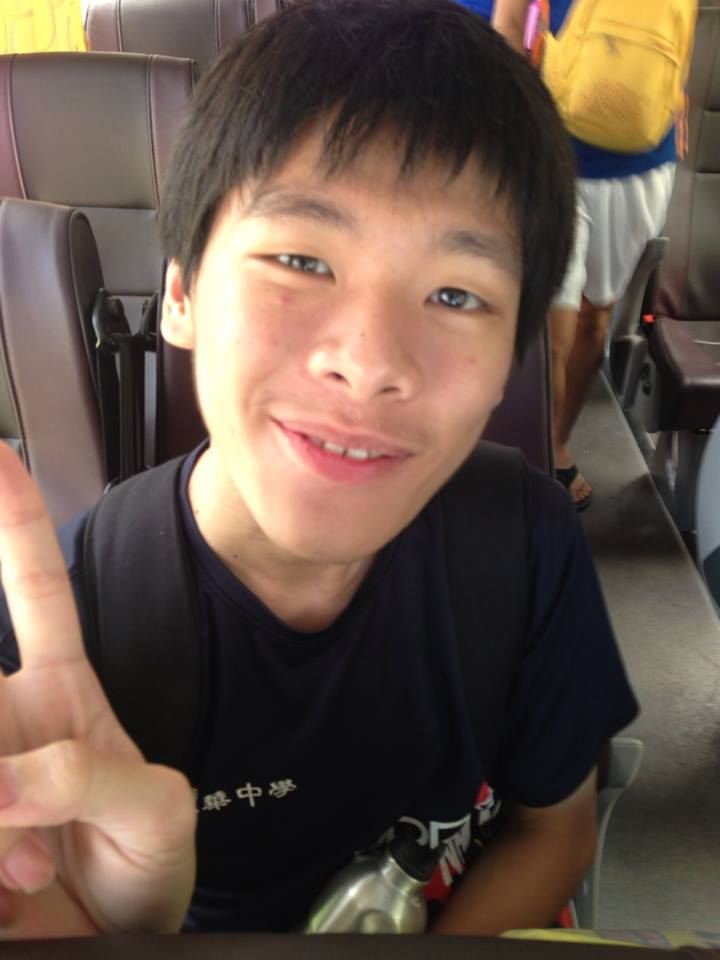
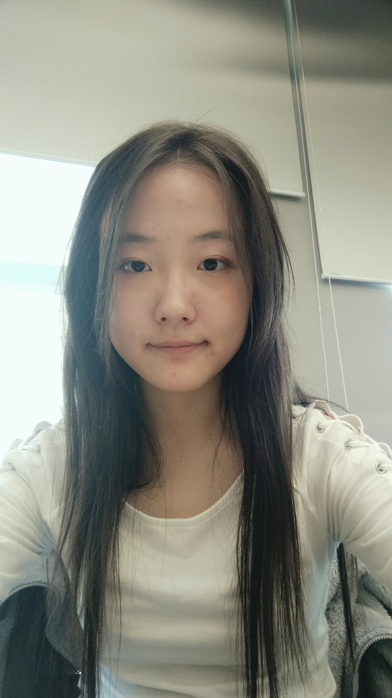

# About Us

We are a team based in the [School of Computing, National University of Singapore](http://www.comp.nus.edu.sg).

## Project Team

#### [Damith C. Rajapakse](http://www.comp.nus.edu.sg/~damithch)  
 
**Role**: Project Advisor

-----

#### Chan Jun Wei
 
**Role**: Project Mentor  

-----

<!-- @@author A0146123R-->
#### [Shi Xiyue](https://github.com/shixiyue)
 

* Components in charge of: [Model](https://github.com/CS2103AUG2016-F10-C4/main/tree/master/src/main/java/seedu/address/model) [Storage](https://github.com/CS2103AUG2016-F10-C4/main/tree/master/src/main/java/seedu/address/storage)
* Aspects/tools in charge of: Code quality, Scheduling and tracking
* Features implemented:
   * [Changing default storage location](https://github.com/CS2103AUG2016-F10-C4/main/blob/master/docs/UserGuide.md#changing-default-storage-location-change)
   * Power Search ([Finding events and tasks by keywords](https://github.com/CS2103AUG2016-F10-C4/main/blob/master/docs/UserGuide.md#finding-all-events-and-tasks-containing-any-keyword-in-their-name-find) and [Filter events and tasks](https://github.com/CS2103AUG2016-F10-C4/main/blob/master/docs/UserGuide.md#filter-events-and-tasks-filter))
   * [Redo]
   * [Undo](https://github.com/CS2103AUG2016-F10-C4/main/blob/master/docs/UserGuide.md#undo-operations-undo)
* Code written: [[functional code](https://github.com/CS2103AUG2016-F10-C4/main/blob/master/collated/main/A0146123R.md)][[test code](https://github.com/CS2103AUG2016-F10-C4/main/blob/master/collated/test/A0146123R.md)][[docs](https://github.com/CS2103AUG2016-F10-C4/main/blob/master/collated/docs/A0146123R.md)]
* Other major contributions:
  * Did the initial refactoring from AddressBook to TaskManager [[#1](https://github.com/CS2103AUG2016-F10-C4/main/pull/1)]
  * Set up Travis and Coveralls
  * Add the Filter Panel in UI [[#46](https://github.com/CS2103AUG2016-F10-C4/main/pull/46)]

<!-- @@author -->
-----

#### [Li Xiaowei](https://github.com/LiXiaoooowei)
 
Role: Developer    
Responsibilities:  
* Logic Component and Common Component I/c: ensure that the codes adhere to coding standards, and update documentation of any changes in the two components 
* Testing I/c: Ensures the testing of the project is done properly and on time.

-----

#### [Angeline Neoh Xing Yii](https://github.com/angellineeee)
 
 Role: Developer    
 Responsibilities: 
* 'UI' Component.
* Documentation I/c: Responsible for the quality of various project documents.
* Integration I/c: In charge of versioning of the code, maintaining the code repository, integrating various parts of the software to create a whole.
